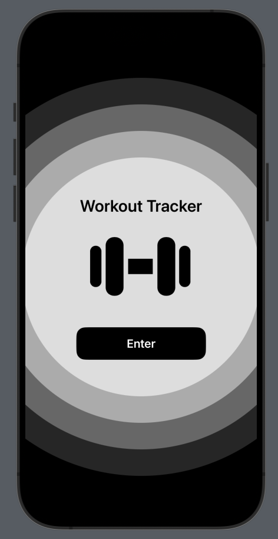
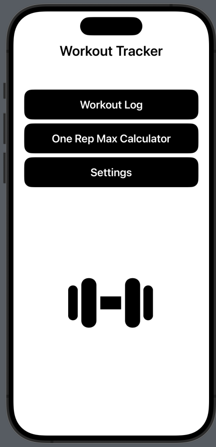
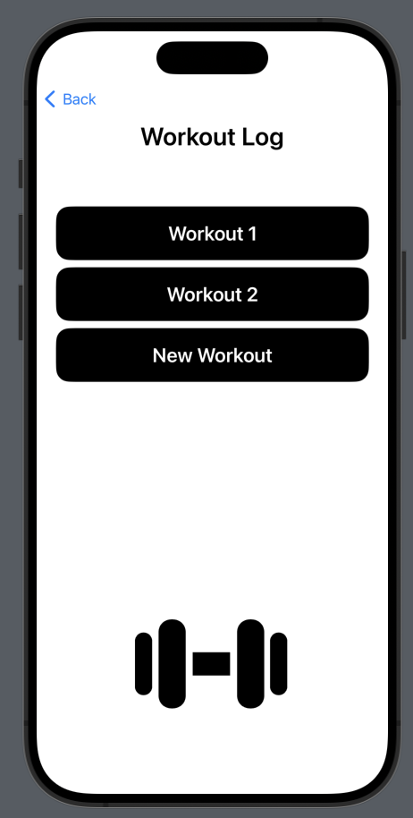
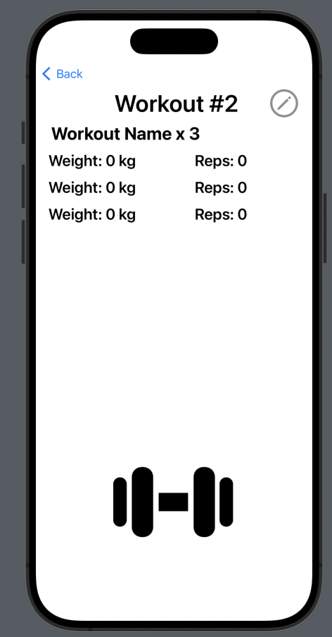
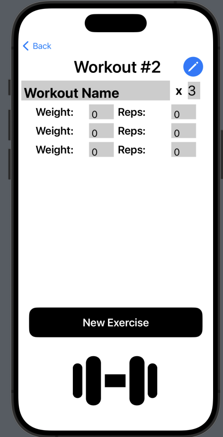
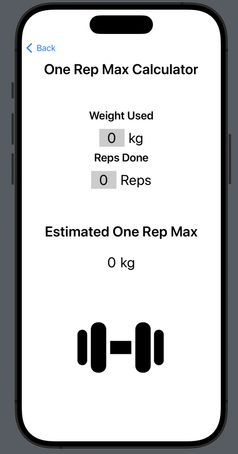
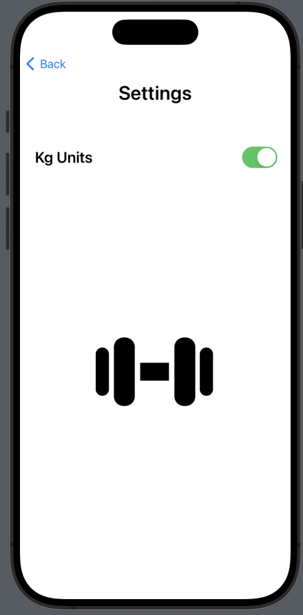

# Summary

This is a personal project of mine to make a workout tracking mobile app using Xcode

# First Screens

When opening the application you are greeted by a enter screen which you only see when booting up the application. 

Then you are led to the main screen where you can go see your workouts, go to a one rep max calculator, or go into settings

# Workouts

When you're in the workouts screen you can create new workouts which are each supposed to be a seperate session of working out

for example if I was doing a leg day I would create add one workout on this screen and then access it by clicking on it

Inside the individual workout in the top right there is an editing button that lets you edit the exercises, weight, and repetitions included in that workout session

When you're done you can go back to look at other workouts or all the way back to the main menu to check out the calculator or settings

# One Rep Max Calculator

This is a simple screen where you input the weight you did and the amount of repetitions you got it for and the screen will output your "one rep max" based on calculations 
that are available online and are fairly accurate 

# Settings

This is another simple screen where the only thing you can change is displaying kg or lbs when looking at your workouts and the one rep max calculator

